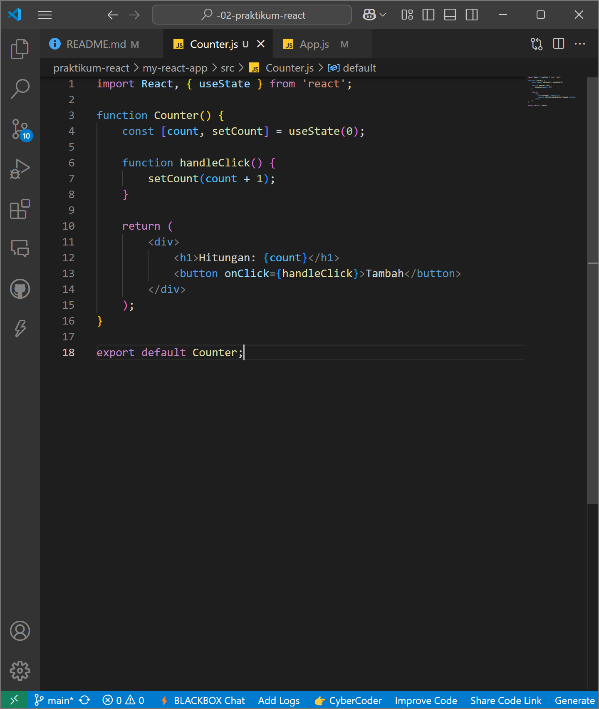

# Laporan Praktikum

|  | Pemrograman Berbasis Framework 2025 |
|--|--|
| NIM |  2241720206 |
| Nama |  Triyana Dewi Fatmawati |
| Kelas | TI - 3D |

## Langkah-langkah Praktikum
### 1. Persiapan Lingkungan
1. Pastikan Node.js dan npm sudah terinstal di komputer Anda. Anda dapat memeriksanya dengan menjalankan perintah berikut di terminal atau command prompt:  

2. Buat direktori baru untuk proyek React Anda:  

3. Inisialisasi proyek React dengan menjalankan perintah berikut:  
  

4. Jalankan aplikasi React dengan perintah:  
Aplikasi akan terbuka di browser pada alamat http://localhost:3000.  

---

### 2. Membuat Komponen React
1. Buka file src/App.js di text editor Anda. 

2. Ganti kode di dalamnya dengan kode berikut untuk membuat komponen sederhana:  

3. Simpan file dan lihat perubahan di browser. Anda akan melihat tampilan sederhana dengan header, konten utama, dan footer.  

---

### 3. Menggunakan JSX untuk Membuat Komponen Dinamis
1. Buat file baru di direktori src dengan nama Counter.js. 

2. Tambahkan kode berikut untuk membuat komponen Counter yang dinamis:  

3. Buka file src/App.js dan impor komponen Counter:  

4. Tambahkan komponen Counter ke dalam komponen App:  

5. Simpan file dan lihat perubahan di browser. Anda akan melihat tombol "Tambah" yang dapat meningkatkan hitungan saat diklik.  

---

### 4. Menggunakan Props untuk Mengirim Data
1. Buat file baru di direktori src dengan nama Greeting.js. 

2. Tambahkan kode berikut untuk membuat komponen Greeting yang menerima props:  

3. Buka file src/App.js dan impor komponen Greeting:  

4. Tambahkan komponen Greeting ke dalam komponen App dan kirim props name:  

5. Simpan file dan lihat perubahan di browser. Anda akan melihat pesan "Halo, Triyana!" yang ditampilkan oleh komponen Greeting.  

---

### 5. Menggunakan State untuk Mengelola Data
1. Buka file src/App.js dan tambahkan kode berikut untuk membuat komponen yang mengelola state:  

2. Tambahkan komponen Example ke dalam komponen App:  

3. Simpan file dan lihat perubahan di browser. Anda akan melihat form input yang dapat mengupdate state dan menampilkan data yang dimasukkan.  

---